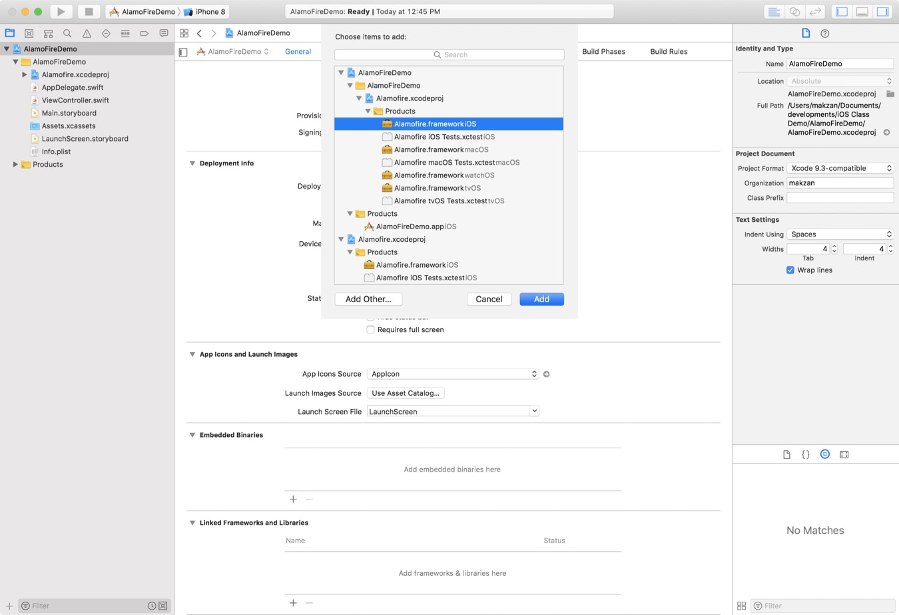
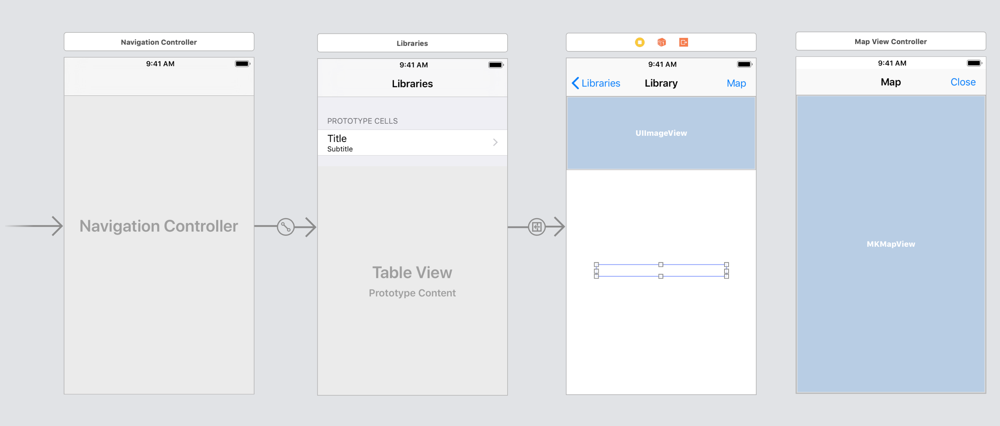

# Example: Library List

In this example, we create a list of libraries in Macao. They are separated by regions. The data are from the [library.gov.mo](https://www.library.gov.mo/)

----

We will use [AlamoFire](https://github.com/Alamofire/Alamofire) to fetch the JSON data.

----

^ Adding framework to project



----

^[](images/library-app-frameworks.png)

----

^ Storyboard



----

We only show essential code snippets. You should be able to connect the views.

^ For detail code, please check example code project.

----

```swift
import Alamofire
```
----

```swift
struct Region: Codable {
    let region: String
    let libraries: [Library]
}
struct Library: Codable {
    let name: String
    let open_hour: String
    let url: String
    let photo: String
    let lat: Double
    let lng: Double
}
```

----

```swift
class LibrariesManager: NSObject {
    static let shared = LibrariesManager()
    
    var result: [Region] = []
    
    func fetch(completion: @escaping (_ result: [Region])->() ) {
        let urlString = "https://sample-json.netlify.com/macao-libraries.json"
        Alamofire.request(urlString).validate().responseJSON { (response) in
            guard let data = response.data else {
                print("Fetch Error")
                return
            }
            guard let decodeResult = try? JSONDecoder().decode([Region].self, from: data) else {
                print("Decode error")
                return
            }
            self.result = decodeResult
            
            print(self.result)
            
            completion(self.result)
        }
    }
}
```

----

^Table View Controller

```swift
let librariesManager = LibrariesManager.shared
var selectedLibrary: Library?
```

----

^Table View Controller

```swift
^Table View Controller
override func viewDidLoad() {
    super.viewDidLoad()

    librariesManager.fetch { (libraries) in
        self.tableView.reloadData()
    }
}
```

----

^Table View Controller

```swift
override func tableView(_ tableView: UITableView, willSelectRowAt indexPath: IndexPath) -> IndexPath? {
    let region = librariesManager.result[indexPath.section]
    let library = region.libraries[indexPath.row]
    selectedLibrary = library
    return indexPath
}
```

----

^Table View Controller

```swift
override func numberOfSections(in tableView: UITableView) -> Int {
    return librariesManager.result.count
}

override func tableView(_ tableView: UITableView, numberOfRowsInSection section: Int) -> Int {
    let region = librariesManager.result[section]
    return region.libraries.count
}
```

----

^Table View Controller

```swift
override func tableView(_ tableView: UITableView, titleForHeaderInSection section: Int) -> String? {
    let region = librariesManager.result[section]
    return region.region
}
```

----

^Table View Controller

```swift
override func tableView(_ tableView: UITableView, cellForRowAt indexPath: IndexPath) -> UITableViewCell {
    let cell = tableView.dequeueReusableCell(withIdentifier: "LibraryRow", for: indexPath)

    // Configure the cell...
    let region = librariesManager.result[indexPath.section]
    let library = region.libraries[indexPath.row]
    
    cell.textLabel?.text = library.name
    cell.detailTextLabel?.text = library.open_hour        
    
    return cell
}
```

----

^Bonus: Adding image view to table row cell

```swift
override func tableView(_ tableView: UITableView, cellForRowAt indexPath: IndexPath) -> UITableViewCell {
    let cell = tableView.dequeueReusableCell(withIdentifier: "LibraryRow", for: indexPath)

    // Configure the cell...
    let region = librariesManager.result[indexPath.section]
    let library = region.libraries[indexPath.row]
    
    cell.textLabel?.text = library.name
    cell.detailTextLabel?.text = library.open_hour
    
    guard let url = URL(string: library.photo) else {
        return cell
    }
    cell.imageView?.af_setImage(
        withURL: url,
        filter: AspectScaledToFillSizeFilter(size: CGSize(width: 50, height: 50))) { (_) in
            self.tableView.reloadRows(at: [indexPath], with: .none)
    }
    
    return cell
}
```

----

^ Code Snippet for Map View

```swift
let point = MKPointAnnotation()
point.title = library.name
point.coordinate = CLLocationCoordinate2D(latitude: library.lat, longitude: library.lng)
mapView.addAnnotation(point)
mapView.setCenter(point.coordinate, animated: true)   
```