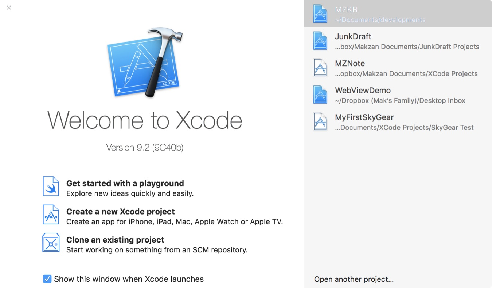
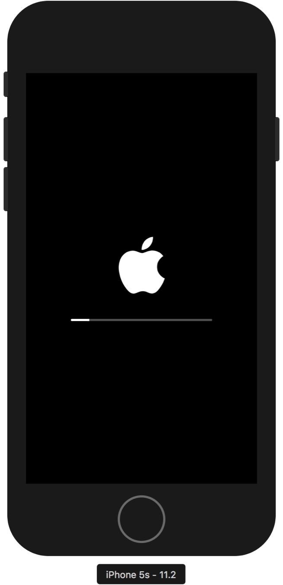
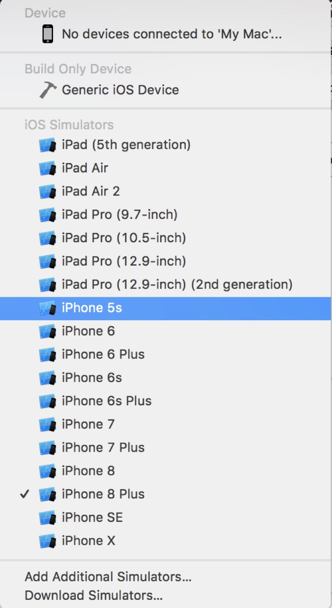
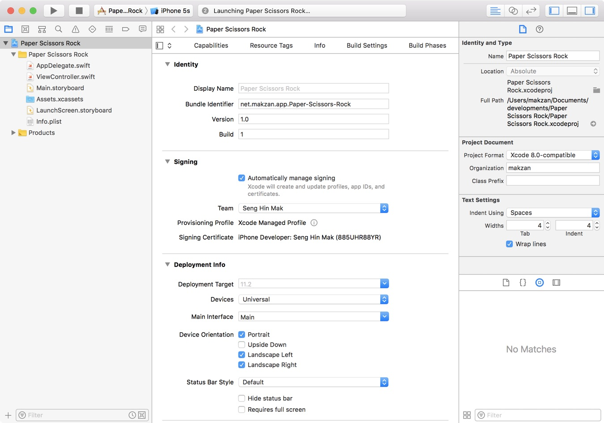
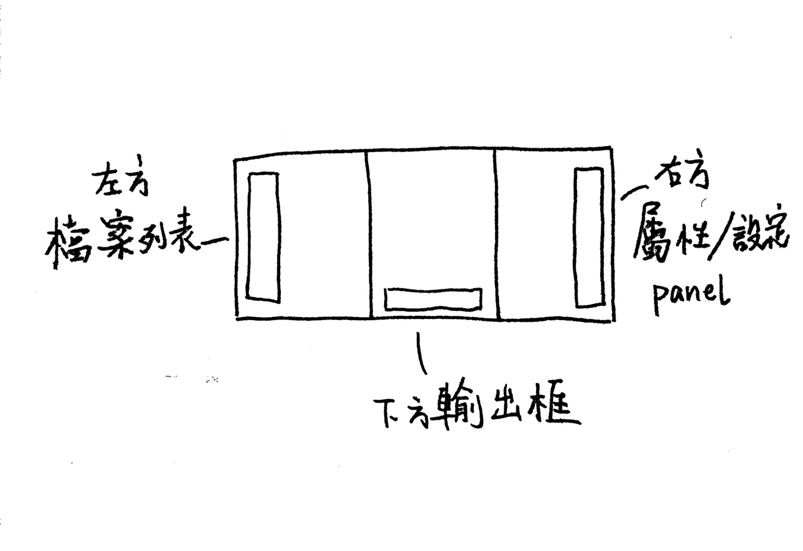
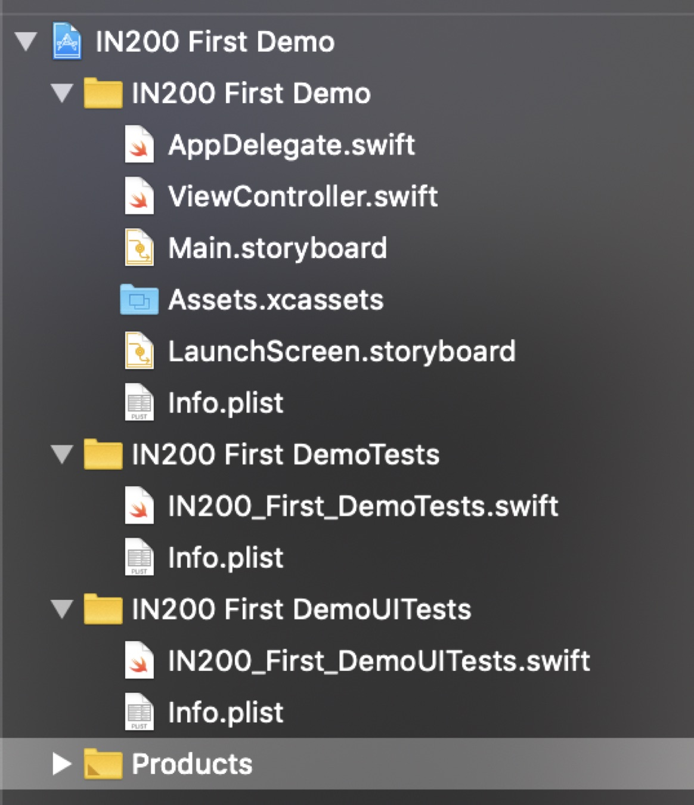

# Lecture 1b

CM420-03-2019-c

----

# Agenda

1. iOS Development Background
2. Xcode IDE

----

# Tools we need to develop iOS app

- a Mac
- Xcode
- iOS Simulator
- Developer Apple ID
----

# Macintosh

Xcode, the development environment, runs only on macOS X.

- Mac mini
- Macbook
- MacBook Air
- MacBook Pro
- iMac
- iMac Pro

----

It is better to have bigger screen for the user interface development.

----

# Deploy iOS on iPhone via Xcode

Previously, developers were required to pay USD99 to deploy apps on iOS device.

Since iOS 9, we only need free developer account to deploy apps on iOS device through Xcode.


----


----

# iOS Development History

----

# 2007: iPhone debut

Steven Jobs promotes writing Web App on iOS.

----

# 2008: iOS 2.0 SDK released

We can develop native app on iPhone.
----

# 2010: iPad debut

We have 2 screen sizes now.

----

# Operating System on iOS

----

^ Operating System on iOS

# Darwin Unix + UIKit

- macOS X’s Darwin Unix system
- **UIKit**—Designed for touch input

----

# Prefix Namespace

There is no package name spacing in iOS.

We use Prefix to name space different classes into different modules.

----

^ Prefix name spacing

e.g. UIKit module with UIView, UILabel, UIButton.

----

^ Prefix name spacing

SpriteKit game framework with SKView, SKScene, SKNode classes.

----

^ Prefix name spacing

CoreLocation framework with CLLocationManager.

----

^ Prefix name spacing

Data structure with NSData, NSArray etc.

----

# NextStep

`NS` stands for NextStep. The computer Steve Jobs built around 1990s.
----

We can tell, even iOS is just 12 years old, it has a much longer OS history because of the Darwin and NextStep System history.

----
When Apple releases Swift, it also remove the `NS` name space on data structures.

- NSData → Data
- NSArray → Array
- NSUserDefaults → UserDefaults

----

Please note that the `NS` removal is not necessary the same.

- `NSArray` and `Array` is different
- `NSUserDefaults` and `UserDefaults` is the same


----

# iOS version support

Normally, we only need to support the latest 2 iOS versions.

The latest 2 versions has [more than 95% adoption](https://mixpanel.com/trends/#report/ios_12/from_date:-31,report_unit:week,to_date:0).

----

# iOS Simulator



----

Before we deploy apps on device, we occasionally deploy apps to simulator for testing.

----



----

iOS Simulator provides us different screen sizes so that we can preview how our apps look like in different devices.


----

# Xcode Interface

----



----

The key point to master Xcode IDE is to master the **left-center-right** panels.

----

- Left: File panel
- Center: Main editor
- Right: Attributes related to the selected item

----


----


----

# Objective-C or Swift?


----

It has been several years since Swift is released. Swift has become stable after years of improvement. New frameworks and tutorials are all written in Swift. It is time to adopt Swift.

----

In Objective-C, we recommend **Message Passing** instead of **Function Calling**.

The difference is that message passing is a request to other object while function calling is a command to other object.

----

It is like speaking English when writing Objective-C:

```objc
[gameObject placeAtX: 123 andY: 456];
```

----

Alternatively, we can write Objective-C message passing by aligning with the colon column:

```objc
[gameObject placeAtX: 123
                   y: 456];
```

----

The method name includes all parameter name and the colon. So the method name is `placeAtX:y:`.

----

Similar Swift code would be:

```
gameObject.placeAt(x:123, y:456)
```

----

We can tell that Swift has a modern syntax while the same philosophy from Objective-C.

----

# Useful files in a project

----

^ Useful files in a project



----

^ Useful files in a project

- `AppDelegate.swift` handles the application **life cycle**.
- `Info.plist` Configure the application, such as application name on home screen and text to display on permission dialog.
- `Main.storyboard` is the main file for defining user interface.
- `LaunchScreen.storyboard` is the user interface our user see during the app launching stage. Beware to not confuse this file with the `Main.storyboard` file.
- `Assets.xcassets` contains the group of image files for icon on home screen and images assets for image view inside the app.
- `ViewController.swift` is the default view controller source code for Single View App template. We will create more `UIViewController` classes later. For example, `HomeViewController`, `LoginViewController`


----
End of Lecture 1b