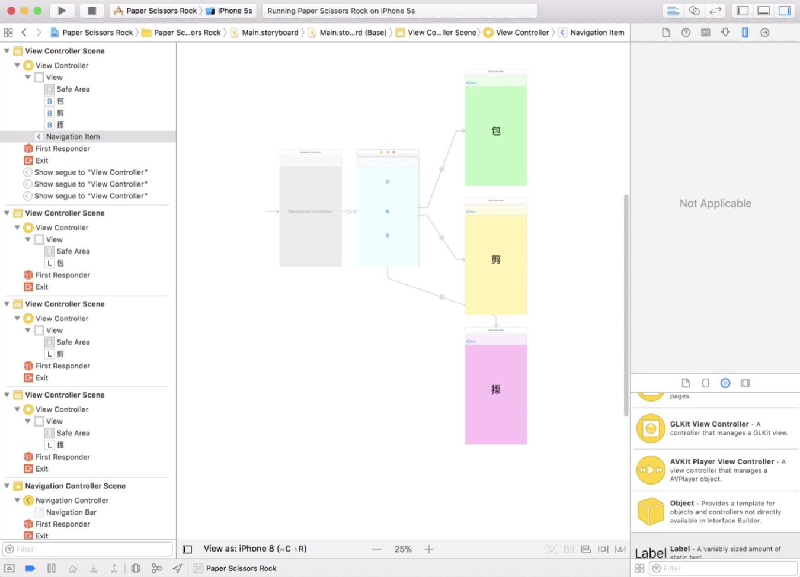
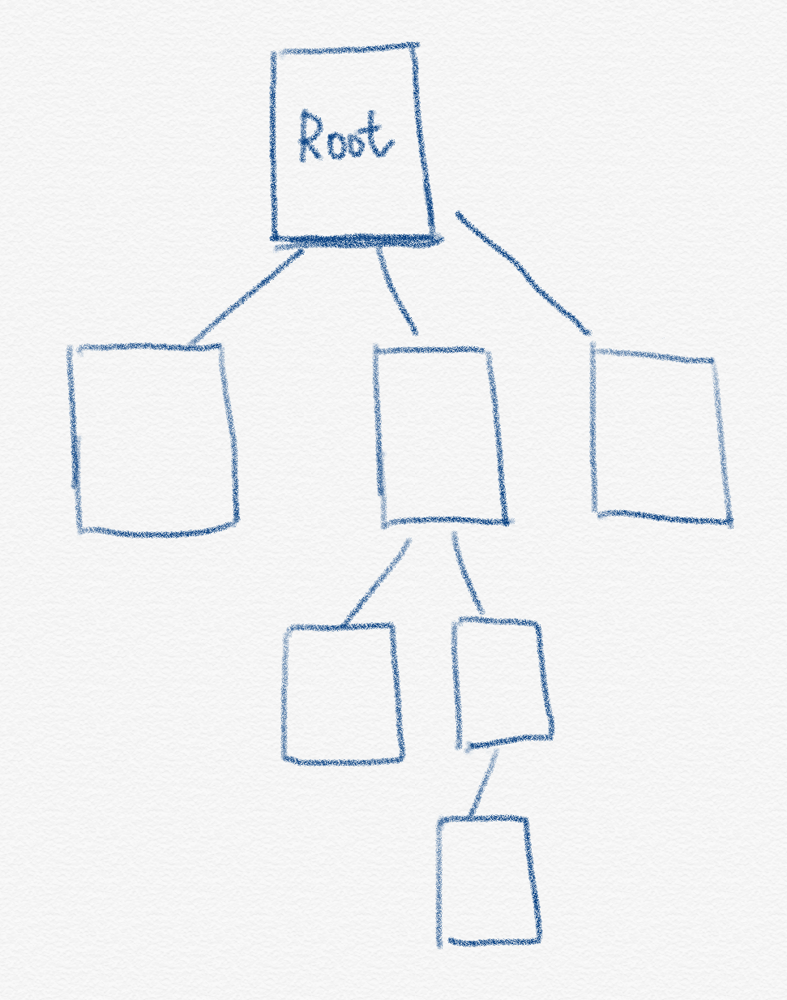
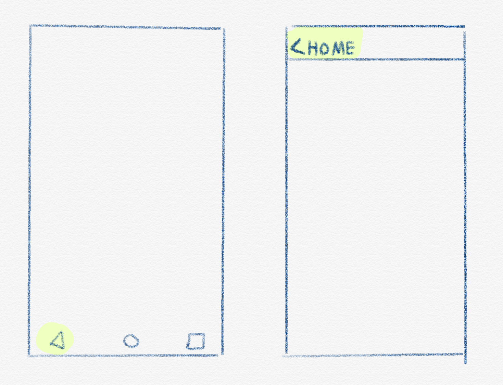

# Lecture 1c

CM420-03-2019-c

----

# Agenda

1. Using Storyboard
2. Building App Prototype
3. Navigation Controller

----

# Building app prototype with Storyboard

----

----

Before we write the single line of code, we can build app prototype solely on Storyboard.

----

# History of Storyboard

NIB → XIB → Storyboard

----
^ History of Storyboard

1. At first, we have separated Interface Builder software alongside Xcode. The interface file of single view is `nib`.
2. Then Interface Builder merges into Xcode and change the file type to `xib`, which uses XML for internal formation representation.
3. Then Storyboard groups multiple views into a single file and we can define relationship between view controllers in user interface.
----

Before Storyboard, we need to write programming code to tell iOS to push or present the next view controller.

By using Storyboard, we can define this relationship in user interface.

----
^ Example of presenting a 2nd view in Storyboard

<iframe src="https://player.vimeo.com/video/293524239?color=ff9933&byline=0&portrait=0" width="800" height="548" frameborder="0" webkitallowfullscreen mozallowfullscreen allowfullscreen></iframe>
----

Please note that we cannot dismiss presented view controller in Storyboard yet. We need to write code to dismiss it.

----

# Navigation Controller

----
^ Hierarchy of view controllers

----

- Navigation Controller allows us to define hierarchy and manage a stack of view controllers.
- Navigation controller allows me to connect scene and going back via the back button on upper left.
- When the previous page has title, the back button on upper left shows the title of previous view controller.

----
^ There is huge difference between Android’s back button and back button on UINavigationController.

----
By showing the title on previous view, we can confirm where we are now in the hierarchy. That’s why it has the name `Navigation`.
----

^ Example of using navigation controller

<iframe src="https://player.vimeo.com/video/293523608?color=ff9933&byline=0&portrait=0" width="800" height="549" frameborder="0" webkitallowfullscreen mozallowfullscreen allowfullscreen></iframe>

----
End of Lecture 1c

