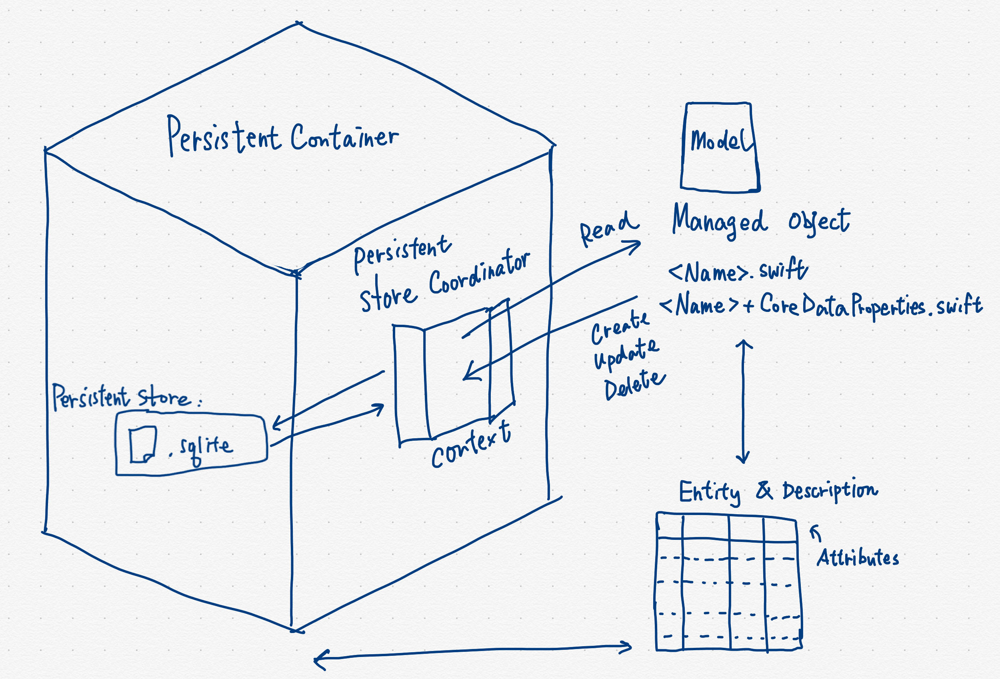

# Persistent Storage

CM420-03-2019-C

---- 

# Storing data

- User Defaults
- File Manager
- Core Data
- Storing in Keychain

---- 
# Storing data remotely

- Your own server
- iCloud
- Firebase

---- 

# User Defaults

UserDefaults saves data into an xml-based plist file within app folder in iOS.

---- 

## Advantages of User Defaults

- No setup required. Work out of the box.
- Easy to use.
- Can encode custom classes via `Codable` protocol.
- Flexible usage

---- 

## Disadvantages of User Defaults

- Not good for storing large amount of data. (They are all loaded in memory)
- Data is removed when app is removed.

---- 

```swift
UserDefaults.standard.set("something", forKey: "key")
```

---- 
```swift
UserDefaults.standard.string(forKey: "key")
```
`
`
---- 
```swift
UserDefaults.standard.removeObject(forKey: "key")
```
`
`---- 

^ Example of using Codable to store custom class in UserDefaults

```swift
let libraries = [
    Library(name: "Testing Library", lat: 110.234, lng: 16.345),
    Library(name: "Another Library", lat: 112.143, lng: 16.456),
    Library(name: "Just for Testing", lat: 111.233, lng: 15.921)
]

guard let encodedData = try? PropertyListEncoder().encode(libraries) else {
    return
}

UserDefaults.standard.set(encodedData, forKey: "libraries")

let librariesFromPlist = UserDefaults.standard.object(forKey: "libraries") as! Data

guard let decodedData = try? PropertyListDecoder().decode([Library].self, from: librariesFromPlist) else {
    return
}
print("Decoded Data")
print(decodedData)

print(decodedData[0].name)
```

---- 

# Core Data

---- 

- PersistentContainer
- PersistentStore
- PersistentStoreCoordinator
- Entity
- EntityDescription
- Context
- Managed Object

---- 



---- 

# Using CoreData template

If we use Core Data template to create our application, it comes with Core Data related methods.

- applicationDocumentsDirectory
- managedObjectModel
- persistentStoreCoordinator
- managedObjectContext
- saveContext

---- 

# Entity

Think as SQL table

---- 

# Attributes

Think as table column

---- 

# Managed Object

Think as record instance

---- 

# Managed Object Context

- Like a workspace that contains managed objects.
- In common case, we can use the default `managedObjectContext`. 

---- 

# Managed Object Code Generation option

---- 

# Editor \> Create NSManagedObject Subclass

- Class Definition
- Category/Extension
- Manual/None

---- 
## Class Definition

- Xcode manages all code generation

---- 

## Category/Extension

- We manage subclass of NSManagedObject
- Xcode manages Extension

---- 

## Manual/None

- We manage everything.
- We manage subclass of NSManagedObject
- We manage Extension

---- 

The more manual it is, the more flexibility we gain.

The more flexibility we gain, the more complexity we have.

---- 

# Code generated

Class contains custom logic

`<Name>.swfit` that extends NSManagedObject

^ Where `<Name>` is the entity name.

---- 

# Code generated

Extension contains Xcode managed changes when we change the Core Data Model 

`<Name>+CoreDataProperties.swift`

^ Where `<Name>` is the entity name.

---- 

Every time when we change the scheme of Core Data Model, we can delete the extension and re-generate it by using the “Create NSManagedObject Subclass” function again.

---- 

# Add Test Data

```swift
let entity = NSEntityDescription.entityForName("Friend", inManagedObjectContext: mangedObjectContext)
```

---- 

# After using `NSManagedObject` subclass

```swift
let friend = Friend(entity: entity, insertIntoManagedObjectContext: managedObjectContext)
friend.name = "Jack"
friend.tel = "66661234"
```

---- 

## Delete records

```swift
persistentContainer.viewContext.delete(friend)
```

---- 


## Relationship between entities

In Core Data Model, select the entity and choose “Add Relationship” to create relationship.

---- 

## Migration

---- 
^ Migration

When we change the scheme in data model, we need to handle the differences between old scheme and new scheme. This is done via migration.

---- 


# Migration: If the app is never on store yet

- we can simply re-install the development app. 
- Alternatively, we can reset the content in simulator to reset the app data.

---- 

# Migration: If the app is already on store yet

Otherwise, we must setup migration in order to let both old app and new app understands the scheme of Core Data model.


---- 

# Further Tutorials

- [https://medium.com/xcblog/core-data-with-swift-4-for-beginners-1fc067cca707](https://medium.com/xcblog/core-data-with-swift-4-for-beginners-1fc067cca707)
- [https://www.raywenderlich.com/7569-getting-started-with-core-data-tutorial](https://www.raywenderlich.com/7569-getting-started-with-core-data-tutorial)

---- 

# Store in Keychain

[https://developer.apple.com/documentation/security/certificate\_key\_and\_trust\_services/keys/storing\_keys\_in\_the\_keychain](https://developer.apple.com/documentation/security/certificate_key_and_trust_services/keys/storing_keys_in_the_keychain)

---- 

# SQLite

If you really need SQLite, you may checkout the following tutorial:

[https://www.raywenderlich.com/167743/sqlite-swift-tutorial-getting-started](https://www.raywenderlich.com/167743/sqlite-swift-tutorial-getting-started)