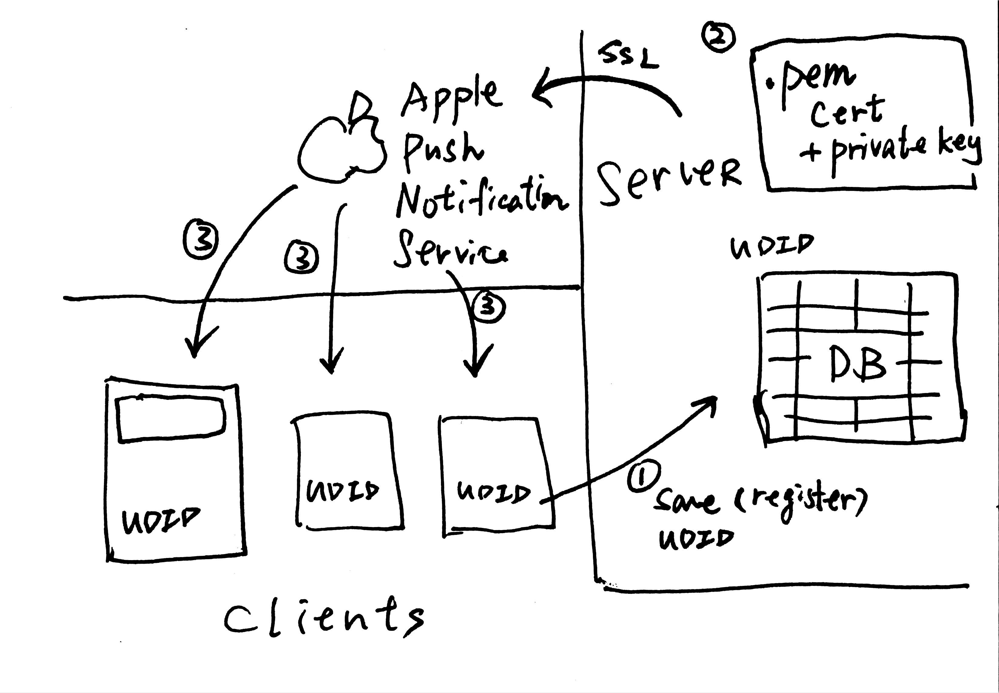

# Push Notification

----

^2 Types of Push Notification

1. Local Notification
2. Remote Notification

----

^2 Types of Push Notification

No difference between local and remote when viewing as end users.

----

# Remote Push Notification

----

## Asking for permission

https://developer.apple.com/documentation/usernotifications/asking_permission_to_use_notifications

----

## Setting up remote notification

https://developer.apple.com/documentation/usernotifications/registering_your_app_with_apns

----

## Sending notification

https://developer.apple.com/documentation/usernotifications/setting_up_a_remote_notification_server/sending_notification_requests_to_apns

----

## More resources

- https://github.com/nomad/houston
- https://docs.fastlane.tools/actions/pem/
- https://medium.com/彼得潘的-swift-ios-app-開發問題解答集/將-push-notification-data-型別的-device-token-變成-string-a89e08736bdf
